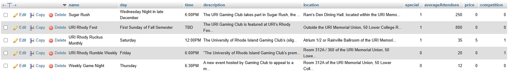
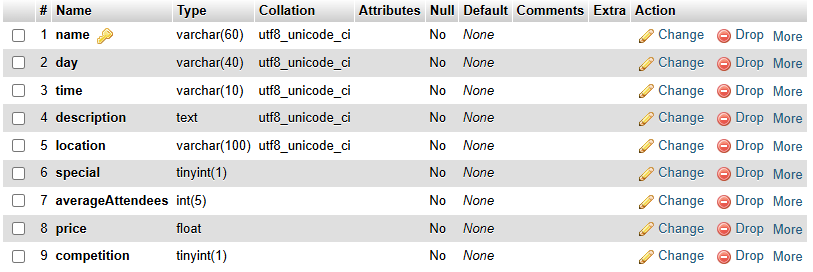
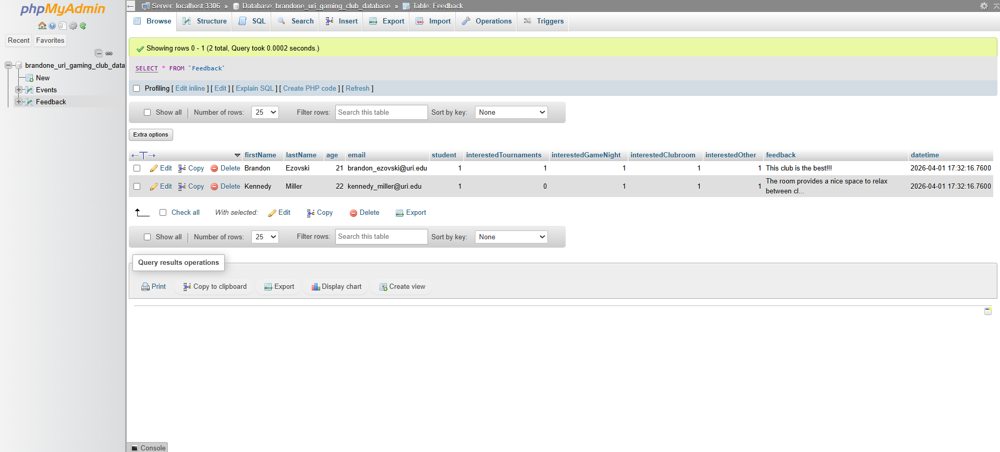
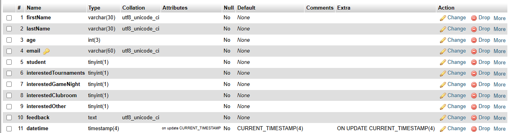

# Database Usage
Since your database cannot be directly viewed by teaching, describe ALL tables you created in your database. You should have created at least TWO tables.
answer the following questions in your document:
### Event Table:
- purpose: hold information on URI Gaming CLub events 
- data: information on the type of events, event descriptions, days and locations they take place, and boolean variables for things like whether they are competitive events or special events (or sometimes both)
- how it supports: Allows for event information on the site to be changed via an update to the database instead of the raw code, so if anything needs to be updated to reflect current club events that can be done so seamlessly.  
- relation to other databases: none
- column names: name, day, time, description, location, special, averageAttendees, price, competition
- data types: varchar(60), varchar(40), varchar(10), text, varchar(100), tinyint(1), int(5), float, tinyint(1), (tinyint(1) is a boolean variable)
- primary key: name
- foreign key(s):none
- Screenshots:

### Form Response Table:
- purpose: hold feedback responses from the feedback page 
- data: all response fields from the feedback form on the site, plus a timestamp of when the form was submitted. There are a few placeholder responses in the table now, but as users fill out the form (and I test more) it will become more populated.
- how it supports: allows for responses to actually be saved by the site so that feedback can be viewed by club e-board and changes can be made to reflect the general sentiment of the club members. Also, data can be updated if the user resubmits the form
- relation to other databases: none
- column names: firstName, lastName, age, email, student, interestedTournament, interestedGameNight, interestedClubroom, interestedOther, feedback, datetime
- data types: varchar(30), varchar(30), int(3), varchar(60), tinyint(1), tinyint(1), tinyint(1), tinyint(1), tinyint(1), text, timestamp(4) (tinyint(1) is a boolean variable)
- primary key: email
- foreign key(s):none 
- Screenshots: 

